<a href="https://profile.saputratech.web.id">
  <picture>
    <source media="(prefers-color-scheme: dark)" srcset="./header-dark.svg">
    <source media="(prefers-color-scheme: light)" srcset="./header.svg" />
    
  </picture>
</a>

<header>
  

    
    
    
  

</header>
